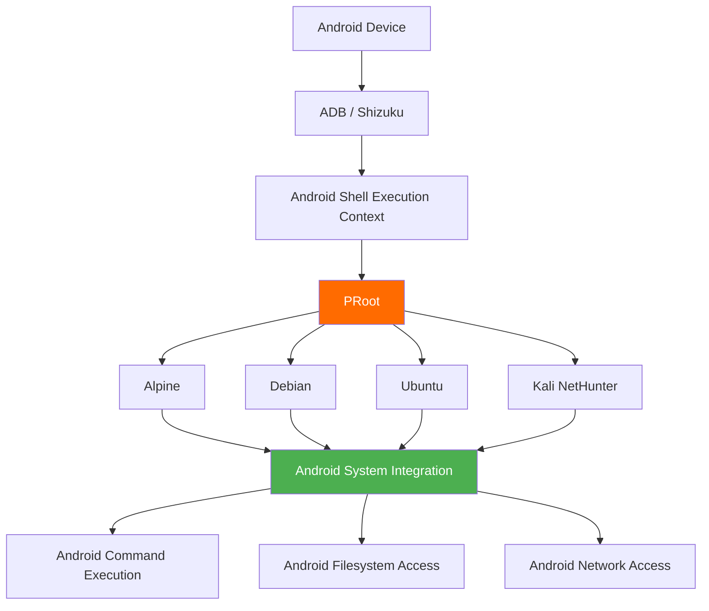

# AndroSH - Run Linux Distributions on Android (No Root, ADB/Shizuku Powered)

<div align="center">

**Run and manage full Linux distributions on your Android device - no root required.**

[](https://github.com/ahmed-alnassif/AndroSH/actions/workflows/tests.yml)
[](https://github.com/ahmed-alnassif/AndroSH/stargazers)
[](https://github.com/ahmed-alnassif/AndroSH/releases)
[](https://python.org)
[](/LICENSE)
[](https://www.android.com)


</div>

## Table of Contents

- [Quick Start](#quick-start)
- [Features](#features)
- [Supported Distributions](#supported-distributions)
- [Overview](#overview)
- [Screenshots](#screenshots)
- [Architecture](#architecture)
- [Installation](#installation)
- [Updating](#updating)
- [Usage](#usage)
- [Use Cases](#use-cases)
- [Security & Privacy](#security--privacy)
- [Components & Sources](#components--sources)
- [Troubleshooting](#troubleshooting)
- [Contributing](#contributing)
- [License](#license)
- [Author](#author)
- [Support](#support)

## Quick Start

> [!Important]
> **Before you start:** install and run [Shizuku](https://github.com/RikkaApps/Shizuku/releases/latest) first. If you're new to AndroSH, read the full [Installation](#installation) section below - it covers Shizuku setup and troubleshooting.

```bash
# In Termux
apt update && apt install -y python git
git clone --depth 1 https://github.com/ahmed-alnassif/AndroSH.git
cd AndroSH
pip install -r requirements.txt
python main.py install

androsh setup demo --distro debian --type stable
androsh launch demo
```

## Features

- **Multi-distro**: run several Linux distributions side by side (Arch, Fedora, Alpine, Debian, Ubuntu, Kali, Void, Manjaro, Chimera, openSUSE)
- **ADB/Shizuku-powered Linux**: run full Linux distributions through Android's elevated Shell layer, with direct Android system integration - no root required
- **SQLite-backed**: fast, reliable tracking of your environments
- **Isolated**: each Linux environment runs through PRoot with userspace filesystem/process isolation
- **GUI support**: works with Termux:X11 for a full desktop environment - [setup guide](https://github.com/ahmed-alnassif/AndroSH/discussions/6#discussioncomment-15720947)

## Supported Distributions


Every distribution above ships from a verified rootfs source and runs in an isolated proot environment - no root required.

## Overview

AndroSH lets you deploy and manage multiple full Linux distributions on Android by running PRoot through the ADB/Shizuku execution layer. This provides elevated Android-side execution without root while retaining direct Android system integration from inside the Linux environments.

| Capability | AndroSH | Typical Alternatives |
|---|---|---|
| Multiple distros at once | Yes | Usually one distro only |
| Environment management | SQLite + CLI | Manual file handling |
| Android system integration | ADB/Shizuku execution | Varies by solution |
| Multiple isolated instances | Yes | Single instance |
| Root required | No (ADB/Shizuku) | Often requires bootloader unlock |

## Screenshots

| Command | Preview | What it shows |
|---|:---:|---|
| `androsh launch kali` | [View](/Assets/Screenshots/launch-kali.png) | Launching the Kali NetHunter environment |
| `androsh list` | [View](/Assets/Screenshots/list-available.png) | All available distributions |
| `androsh lsd` | [View](/Assets/Screenshots/list-installed.png) | Environments you've already installed |

## Architecture

```
Android Device → ADB/Shizuku Execution Context→ Proot Virtualization → Linux Environment(s)
```



From inside any distro, you can reach into the Android system directly:

```bash
# List installed Android packages
pm list packages -f

# Kernel info
cat /proc/version

# Android system properties
getprop | grep version

# Network routes
ip route show
```

## Installation

### Requirements

- Android device with [Shizuku](https://github.com/RikkaApps/Shizuku/releases/latest) installed and running
- Python 3.8+
- [Termux](https://github.com/termux/termux-app/releases/latest) or a compatible terminal emulator
- At least 2 GB free storage

### Setup

```bash
# Install prerequisites in Termux
apt update && apt install -y python git

# Get AndroSH
git clone --depth 1 https://github.com/ahmed-alnassif/AndroSH.git
cd AndroSH

# Install dependencies
pip install -r requirements.txt

# Make the `androsh` command available globally
python main.py install
```

> [!Tip]
> when you run `androsh setup`, AndroSH automatically checks whether Shizuku is configured correctly and walks you through fixing it if not.

## Updating

```bash
cd AndroSH
git pull
pip install -r requirements.txt
```

## Usage

### Deploy an environment

```bash
androsh setup production --distro debian --type stable
```

### Launch it

```bash
androsh launch production
# You're now root inside the Debian environment
root@localhost:~# apt update && apt install python3 git
```

### Manage environments

```bash
androsh list                       # See what's available to install
androsh lsd                        # See what's already installed
androsh clean production           # Free up space / remove temp files
androsh remove production --force  # Delete an environment
```

### Manage distributions directly

```bash
androsh distro list                                              # List available distros
androsh distro info ubuntu                                       # Get details on a distro
androsh distro download alpine --type alpine-minirootfs --file alpine-edge.tar.gz
```

### Full command reference

See [AndroSH_Help.md](Assets/docs/AndroSH_Help.md) for every command and flag, including verbosity control (`--verbose` / `--quiet`) and timestamp formatting (`--time-style`).

## Use Cases

**Learning Linux**
```bash
androsh setup classroom --distro ubuntu --type stable
apt install gcc python3-dev git curl wget
```

**Security research / penetration testing**
```bash
androsh setup pentest --distro kali-nethunter --type full
apt install nmap metasploit-framework wireshark
```

**Lightweight dev environments**
```bash
androsh setup devops --distro alpine --type alpine-minirootfs
apk add build-base git nodejs npm docker-cli
```

**On-the-go workstation**
```bash
androsh setup field --distro debian --type stable
apt install vim tmux htop net-tools
```

**Running several environments at once**
```bash
androsh setup frontend --distro ubuntu -t stable
androsh setup backend --distro debian -t stable
androsh setup security --distro kali-nethunter -t nano
androsh lsd
```

## Security & Privacy

- **Android privilege boundary**: Android-side operations run within the permissions available to the ADB/Shizuku execution context; no Android root is required.
- **Process isolation**: each environment runs sandboxed via proot
- **Integrity checks**: SHA-256 checksums validate every download
- **No telemetry**: zero data collection, everything stays local on your device
- **Open source**: every component is auditable

## Components & Sources

| Component | Source | Purpose |
|---|---|---|
| PRoot | [ahmed-alnassif/proot](https://github.com/ahmed-alnassif/proot) | Statically linked, Android-optimized automated builds |
| BusyBox NDK | [Magisk-Modules-Repo/busybox-ndk](https://github.com/Magisk-Modules-Repo/busybox-ndk) | Core Unix utilities (tar, grep, awk, etc.) for Android |

Build pipelines: [PRoot builder](https://github.com/ahmed-alnassif/proot) · [BusyBox NDK sources](https://github.com/ahmed-alnassif/busybox) · [AndroSH core](https://github.com/ahmed-alnassif/AndroSH)

All dependencies are traceable to their upstream sources and kept in sync with security updates.

## Troubleshooting

**Reset a broken environment**
```bash
androsh setup <distro> --distro debian -t stable --resetup
```

**Clean up temp files**
```bash
androsh clean <distro>
```

**Reinstall the global `androsh` command**
```bash
cd AndroSH
python main.py install
```

**Shizuku issues**
- Confirm Shizuku is running and AndroSH is authorized in it
- If problems persist, reboot the device to restore the Shizuku service

## Contributing

Contributions and security research are welcome. Current priority areas:

- Performance optimization
- Deployment tooling
- Security hardening

Set up a dev environment:

```bash
git clone https://github.com/ahmed-alnassif/AndroSH.git
cd AndroSH
python -m venv venv
source venv/bin/activate
pip install -r requirements.txt
```

## License

GPLv3 - free for commercial and research use.

## Author

**Ahmed Al-Nassif**
- GitHub: [@ahmed-alnassif](https://github.com/ahmed-alnassif)

## Support

- Star the repo if you find it useful
- Open an issue to report bugs
- Suggest features or share how you're using AndroSH

---

<div align="center">

*Professional Linux environments in your pocket - without requiring Android root.*

</div>
